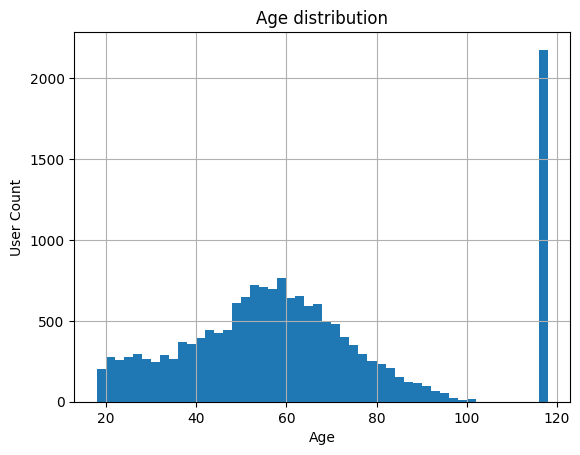
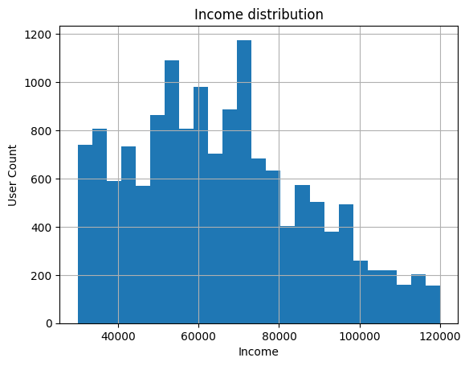
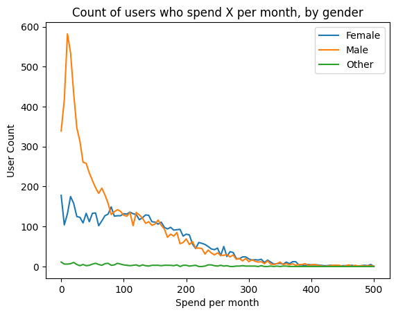
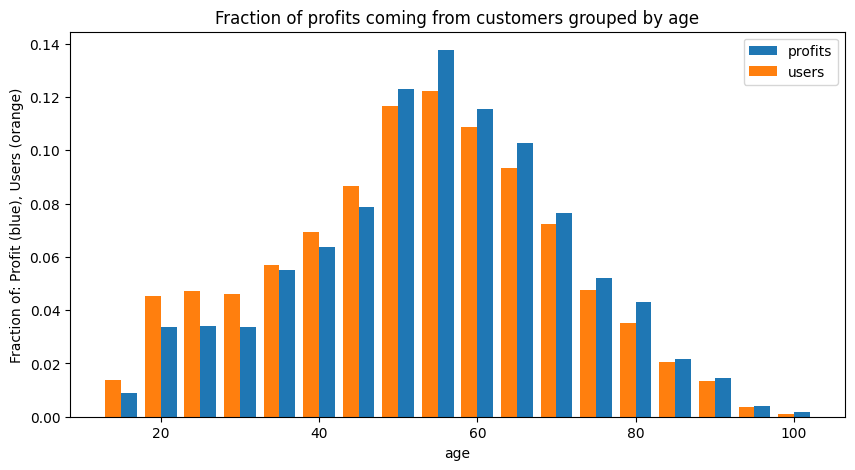
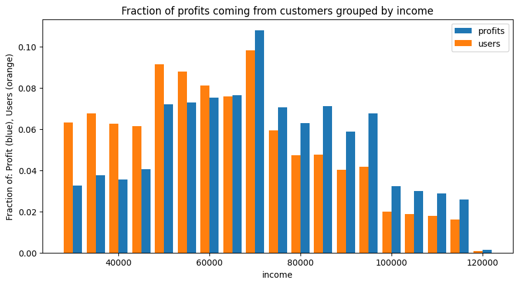
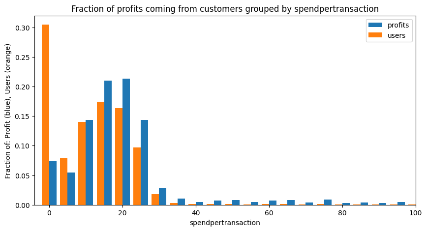

# Starbucks Promotions: Predisposition of Customers to Promotions and Offers


Are certain individuals more predisposed to being driven by promotions and offers? That is, can we identify certain individuals who will engage (ie. spend more) with our business solely based on offers, such as discounts, that are made available to them? In the case of Starbucks, my analysis has found little to no correlation between the total spending from customers and the kinds or amounts of offers made available to them. This is not to say that offers and promotions are not effective - in fact, I suggest that future works focus on how to maximize the effectiveness of our offers. However, when we look at regular Starbucks mobile app users and their overall engagement with Starbucks, I see little correlation in the types of offers being made and the total amount they spend at Starbucks. As a result of this analysis, I suggest that future analytics efforts focus on the promotions themselves and how to make them effective, as opposed to identifying specific demographics that will respond strongly to promotions.

## Section 1: Project Definition

### Project Overview

Starbucks has provided students enrolled in Udacity's data science nanodegree with simulated data for users of the Starbucks mobile app. In this dataset, 17000 users have been simulated, and we have been provided with demographic information for each of these simulated users. Additionally, information on the different types of promotions which have been offered to these users is provided.

This simulated data takes place over a 30 day period, during which 167,581 offers were made to these customers, and 138,953 purchases were made. At a high level, I have been asked to identify effective uses of promotions in the future. 

### Problem Statement 
<!-- define the problem to be solved. -->
There are a wide variety of questions which could be asked of these data. Are buy-one-get-one (bogo) offers more effective at driving engagement than discounts? Do shorter durations of offer availability drive more frequent engagement? Are certain demographics more likely to respond to certain types of promotions?

In this analysis, I have chosen to focus on overall customer spending and its relation to promotions. Specifically, I woud like to identify the type of relationship, or lack thereof, between the offers being made to customers and their relative spending at Starbucks. In other words, with all else being equal, do Starbucks app users (referred to as users hereon) who receive more offers or specific kinds of offers spend significantly more than average? Included in this question is the efficacy of certain promotion types or communication channels. For instance, are do discounts drive more spending from users than bogo offers? Is email more effective at driving spending than social media?

### Metrics
<!-- define the metrics to measure the results and justifications to use the metrics. For example, if you use time-series data sets, what metrics will be appropriate to measure the results. -->

I have selected "overall spend" (spend from hereon) as my primary metric for efficacy of promotions. Specifically, I will consider the total spending per-customer over the 30 day period of this experiment as my primary metric. If I have a group of demographically similar people, is their spend correlated to the types and amounts of offers they received during this period?

There are several other variables that coud be used as metrics, such as "was this particular offer viewed and/or completed," and "number of visits to starbucks during this time period." However, while these may be useful (they almost certainly are!) for evaluating the efficacy of certain promotions, Starbucks is ultimately not in the business of making effective promotions. Starbucks will want to maximize revenue, which is related to maximizing spending per customer.

An interesting wrinkle in this analysis is the goal of maximizing revenue, and not necessarily spending-per-customer. An extreme implication of this is if we have "superusers," users who spend so much at Starbucks that they make up a disproportionately large amount of the profit base. It will be a much more effective user of our time to increase spending from our primary profit base than to try and increase every individuals' spending. As such, we will try to focus our analysis on demographics that could potentially have the greatest impact on overall profit.

## Section 2: Analysis
### Data Exploration
<!-- describe the data sets, including the features, data distributions, and descriptive statistics. Identify any abnormalities or specific characteristics inherent in the data sets. 
-->

Three tables of data have been provided by Starbucks for this analysis:

### portfolio - containing offer ids and meta data about each offer (duration, type, etc.). 
- table shape: 10 rows, 6 columns
- Columns are:
    - reward (int) - dollar value of the reward being offered for completing this offer
    - channels (araay[str]) - contains the channels which were used to deliver the offer. can be multiple entries from email, web, mobile, and social.
    - difficulty (int) - dollar value which the user must spend to redeem the offer
    - duration (int) - days from offer delivered date that the user has to complete an offer before it expires
    - offer_type (int) - nature of the offer, either bogo, informational (reward and difficulty are both 0 for this), or discuount
    - id (str) - unique id for this promo type

### profile - demographic data for each customer
- table shape: 17,000 rows, 5 columns
- Columns:
    - age (int) - age of the customer 
    - became_member_on (int) - date when customer created an app account
    - gender (str) - gender of the customer, either M,F, or O (other)
    - id (str) - customer id
    - income (float) - customer's yearly income

It is useful to understand the ranges for some of these categories.

```
>>> profile["gender"].value_counts(dropna=False)

===== GENDER ======
M       8484
F       6129
None    2175
O        212
```

Slightly more men have been simulated in this study - I will assume that this is representative of the actual users in the true Starbucks app. Additionally, exploring other fields reveals that users who replied "None" also lack any identifying information for age or income. As I am interesting in comparing like users for the efficacy of promos, we will probably exclude these users. 



Ages are normally distributed. It looks like the minimum allowed user age is 18 - it is possible that there is a bump here because users either user 18 as a default, or underage users just say they are 18. This is not a major issue, as the data looks basically normal. The major spike at 118 is a default value, and corresponds to "None" entries on gender - we will ignore these.



```
>>> profile.income.describe()
===== INCOME ======
count     14825.000000
mean      65404.991568
std       21598.299410
min       30000.000000
25%       49000.000000
50%       64000.000000
75%       80000.000000
max      120000.000000
```

Data skews to the right, and this generally looks as expected. 

"became_member_on" is a trickier field - it would be more useful if this was numeric and it described the length of a users's membership, in days. We will create this value, and call it "tenure".

``` python
profile["joindate"] = pd.to_datetime(profile["became_member_on"],format="%Y%m%d")
profile["tenure"] = (profile["joindate"] - profile["joindate"].min()).dt.days
```

```
>>> profile.tenure.describe()
count    17000.000000
mean      1305.550118
std        411.223904
min          0.000000
25%       1032.000000
50%       1465.000000
75%       1615.000000
max       1823.000000
```


This is a very strange looking distribution to me. There must have been major pushes for membership at certain points in time, causing new users to be introduced.


### transcript - records for transactions, offers received, offers viewed, and offers completed
- table shape: 306,534 rows, 4 columns
- Columns:
    - event (str) - type of evet, either offer received, offer viewed, offer completed, or transaction
    - person (str) - customer id
    - time (int) - time in hours since start of test. The data begins at time t=0. The maximum value for this is 714, which is 29.75 days
    - value - (dict of strings) - either an offer id or transaction amount depending on the record

```
>>> print(transcript.event.value_counts(dropna=False))
transaction        138953
offer received      76277
offer viewed        57725
offer completed     33579
```

Not quite half of our events are transactions, and we see descending values of offers received, viewed, and completed. This is not surprising.


During the experimental period, there were fixed days on which offers would go out to customers. This is pretty useful for comparing the efficacy of one offer versus another.

The transcript is not easy to read in its current state. If I join the portfolio data to it, I can explore the offer types much more easily.

```python
df = transcript.merge(profile,how='left',left_on='person',right_on='id')
df = df[[
    "person",
    "event",
    "value",
    "time",
    "gender",
    "age",
    "income",
    "tenure"
]]

df["amount"] = df.value.apply(lambda x: x.get("amount",0))
df["offerid"] = df.value.apply(lambda x: x.get("offer id",x.get("offer_id",0)))

df = df.merge(portfolio, how='left', left_on="offerid", right_on="id")

df = df[[
    "person",
    "event",
    # "value",
    "time",
    "gender",
    "age",
    "income",
    "tenure",
    "amount",
    'offername',
    'channels', 
    'reward', 
    'difficulty', 
    'duration', 
    'offer_type', 
    'mobile', 
    'web', 
    'social', 
    'email', 
]]

df.time = df.time/24.0

df.head()
```

|    | person                           | event          |   time | gender   |   age |   income |   tenure |   amount | offername        | channels                             |   reward |   difficulty |   duration | offer_type   |   mobile |   web |   social |   email |
|---:|:---------------------------------|:---------------|-------:|:---------|------:|---------:|---------:|---------:|:-----------------|:-------------------------------------|---------:|-------------:|-----------:|:-------------|---------:|------:|---------:|--------:|
|  0 | 78afa995795e4d85b5d9ceeca43f5fef | offer received |      0 | F        |    75 |   100000 |      443 |        0 | bogo_7_5_5       | ['web', 'email', 'mobile']           |        5 |            5 |          7 | bogo         |        1 |     1 |        0 |       1 |
|  1 | a03223e636434f42ac4c3df47e8bac43 | offer received |      0 |          |   118 |      nan |      356 |        0 | discount_10_20_5 | ['web', 'email']                     |        5 |           20 |         10 | discount     |        0 |     1 |        0 |       1 |
|  2 | e2127556f4f64592b11af22de27a7932 | offer received |      0 | M        |    68 |    70000 |       91 |        0 | discount_7_10_2  | ['web', 'email', 'mobile']           |        2 |           10 |          7 | discount     |        1 |     1 |        0 |       1 |
|  3 | 8ec6ce2a7e7949b1bf142def7d0e0586 | offer received |      0 |          |   118 |      nan |      304 |        0 | discount_10_10_2 | ['web', 'email', 'mobile', 'social'] |        2 |           10 |         10 | discount     |        1 |     1 |        1 |       1 |
|  4 | 68617ca6246f4fbc85e91a2a49552598 | offer received |      0 |          |   118 |      nan |      297 |        0 | bogo_5_10_10     | ['web', 'email', 'mobile', 'social'] |       10 |           10 |          5 | bogo         |        1 |     1 |        1 |       1 |

Now that I have the channel data one-hot encoded, as well as adding in offer information, it is much easier to understand the transcript data.


### Data Visualization
<!-- build data visualization based on the data exploration in the previous step. -->

As stated above, I am interested in understanding how to maximize profit from the most profitable base using promotions. This means I will summarize the data on a per-user basis, and examine how certain factors affect profitability.

I will create a detailed "person" table, and then explore it visually.

```python
person_g = df.groupby([
    "person",
    "gender",
    "age",
    "income",
    "tenure"
])

person_spend = person_g.amount.sum()
person_mobile = person_g.mobile.sum()
person_web = person_g.web.sum()
person_social = person_g.social.sum()
person_email = person_g.email.sum()

person_g_offersonly = df[df.event == "offer received"].groupby([
    "person",
    "gender",
    "age",
    "income",
    "tenure"
])

person_offers_total = person_g_offersonly.offername.count()

person_offers = df[df.event == "offer received"].pivot_table(index=[
    "person",
    "gender",
    "age",
    "income",
    "tenure"
], columns='offername', aggfunc='size', fill_value=0)

person_offers_type = df[df.event == "offer received"].pivot_table(index=[
    "person",
    "gender",
    "age",
    "income",
    "tenure"
], columns='offer_type', aggfunc='size', fill_value=0)

person_events = df.pivot_table(index=[
    "person",
    "gender",
    "age",
    "income",
    "tenure"
], columns='event', aggfunc='size', fill_value=0)

for col in person_events:
    person_offers[col] = person_events[col]

for col in person_offers_type:
    person_offers[col] = person_offers_type[col]

person_offers["spend"] = person_spend
person_offers["totaloffers"] = person_offers_total
person_offers["spendpertransaction"] = person_offers["spend"] / person_offers["transaction"]

person_offers["mobile"] = person_mobile
person_offers["web"] = person_web
person_offers["social"] = person_social
person_offers["email"] = person_email

# person_offers

df_p = person_offers.reset_index()
df_p.head()
```

|    | person                           | gender   |   age |   income |   tenure |   bogo_5_10_10 |   bogo_5_5_5 |   bogo_7_10_10 |   bogo_7_5_5 |   discount_10_10_2 |   discount_10_20_5 |   discount_7_10_2 |   discount_7_7_3 |   informational_3_0_0 |   informational_4_0_0 |   offer completed |   offer received |   offer viewed |   transaction |   bogo |   discount |   informational |   spend |   totaloffers |   spendpertransaction |   mobile |   web |   social |   email |   age_bin |   bin |   spend_bin |
|---:|:---------------------------------|:---------|------:|---------:|---------:|---------------:|-------------:|---------------:|-------------:|-------------------:|-------------------:|------------------:|-----------------:|----------------------:|----------------------:|------------------:|-----------------:|---------------:|--------------:|-------:|-----------:|----------------:|--------:|--------------:|----------------------:|---------:|------:|---------:|--------:|----------:|------:|------------:|
|  0 | 0009655768c64bdeb2e877511632db8f | M        |    33 |    72000 |      461 |              0 |            1 |              0 |            0 |                  1 |                  0 |                 1 |                0 |                     1 |                     1 |                 3 |                5 |              4 |             8 |      1 |          2 |               2 |  127.6  |             5 |              15.95    |       12 |    10 |        8 |      12 |        30 |    12 |         125 |
|  1 | 0011e0d4e6b944f998e987f904e8c1e5 | O        |    40 |    57000 |      198 |              0 |            0 |              0 |            1 |                  0 |                  1 |                 0 |                1 |                     1 |                     1 |                 3 |                5 |              5 |             5 |      1 |          2 |               2 |   79.46 |             5 |              15.892   |       10 |    11 |        5 |      13 |        40 |    13 |          75 |
|  2 | 0020c2b971eb4e9188eac86d93036a77 | F        |    59 |    90000 |      874 |              1 |            0 |              1 |            0 |                  2 |                  0 |                 0 |                0 |                     1 |                     0 |                 3 |                5 |              3 |             8 |      2 |          2 |               1 |  196.86 |             5 |              24.6075  |       11 |     8 |       11 |      11 |        55 |    11 |         195 |
|  3 | 0020ccbbb6d84e358d3414a3ff76cffd | F        |    24 |    60000 |      622 |              0 |            1 |              0 |            1 |                  0 |                  0 |                 0 |                1 |                     1 |                     0 |                 3 |                4 |              4 |            12 |      2 |          1 |               1 |  154.05 |             4 |              12.8375  |       11 |     9 |        8 |      11 |        20 |    11 |         150 |
|  4 | 003d66b6608740288d6cc97a6903f4f0 | F        |    26 |    73000 |      400 |              0 |            0 |              0 |            0 |                  2 |                  1 |                 0 |                0 |                     1 |                     1 |                 3 |                5 |              4 |            18 |      0 |          3 |               2 |   48.34 |             5 |               2.68556 |       10 |    10 |        8 |      12 |        25 |    12 |          45 |

This has created an extensive customer profile table. Some key values in here include the amount of offers received per customer, the total spend per customer, the spend-per-transaction, total transaction count, and the counts of communication channels used.

Already, we see a potential weakness in this analysis - we will not be looking at duration, difficulty, and rewards of offers. However, this is not the goal of our analysis - we want to understand if there are specific groups of customers who are, overall, more interested in promotions than others, and if this drives profits.

Since we are interested in maximizing profits, I will explore spending and its relationships a little bit:


The median spending of users almost doubles as their age goes from 18-19 to 55-60. Interestingly, all of these plots have very long upward tails, which may indicate that our profit base may be with higher-spenders.


This is an interesting plot. The blue bars represent "fraction of total profits". The X-axis is the total spending by a customer. The orange bars represent the fraction of users who actually spend that amount. What this means is that, while our customers have a right-skewing distribution (ie there are many users who only spend a small amount), our profits are centered around users who spend $150 to $200 a month. Any analysis we want to do should focus on maximizing engagement from this group.



Interestingly, we notice a distinct difference in spending between men and women. Men have a much higher number of "low spenders", but otherwise they have similar looking profiles. It may be that casual starbucks users who are male are more likely to become app users, but otherwise superusers who are male or female behave similarly.

Later in our modeling, we will exclude low spenders, since these two plots show that:
1. Only a small amount of our profits come from low spenders
2. We have reason to believe that these users behave differently from the rest of the user population, and their behavior may alter our modeling.



Interstingly, our profit base appears to be fairly well-distributed among our ages. This agrees with our spending-by-age plot above - younger people spend a little less than older users, and we see here that our profit base skews to older users, but not by much.



Similar to our age profiling, we see some skewing of our profit base by user income, but not by much. 



Spend-per-transaction is very important for our profit base. Users who spend $0-$4 per transaction make up nearly 30% of the user base, but account for only about 7% of profits. This further indicates that we will want to focus on driving engagement from our most profitable users.

I would now like to start understanding how the offers being made to the customers work in driving profits.

```python
def show_corr(df):
    df_p_corr = df[[
        "age",
        "income",
        "tenure",
        'offer received',
        "offer viewed",
        "offer completed",
        "transaction",
        "spend",
        "spendpertransaction",
        "mobile",
        "web",
        "social",
        "email",
        "totaloffers"
    ]]

    corr = df_p_corr.corr()
    return corr.style.background_gradient(cmap='coolwarm',vmin=-1,vmax=1)

show_corr(df_p)
```
<style type="text/css">
#T_98eeb_row0_col0, #T_98eeb_row1_col1, #T_98eeb_row2_col2, #T_98eeb_row3_col3, #T_98eeb_row3_col13, #T_98eeb_row4_col4, #T_98eeb_row5_col5, #T_98eeb_row6_col6, #T_98eeb_row7_col7, #T_98eeb_row8_col8, #T_98eeb_row9_col9, #T_98eeb_row10_col10, #T_98eeb_row11_col11, #T_98eeb_row12_col12, #T_98eeb_row13_col3, #T_98eeb_row13_col13 {
  background-color: #b40426;
  color: #f1f1f1;
}
#T_98eeb_row0_col1, #T_98eeb_row1_col0, #T_98eeb_row5_col8, #T_98eeb_row6_col11, #T_98eeb_row8_col5, #T_98eeb_row11_col6 {
  background-color: #f7bca1;
  color: #000000;
}
#T_98eeb_row0_col2, #T_98eeb_row2_col0 {
  background-color: #dedcdb;
  color: #000000;
}
#T_98eeb_row0_col3, #T_98eeb_row0_col13, #T_98eeb_row1_col3, #T_98eeb_row1_col13, #T_98eeb_row2_col3, #T_98eeb_row2_col13, #T_98eeb_row3_col0, #T_98eeb_row3_col1, #T_98eeb_row3_col2, #T_98eeb_row13_col0, #T_98eeb_row13_col1, #T_98eeb_row13_col2 {
  background-color: #dcdddd;
  color: #000000;
}
#T_98eeb_row0_col4, #T_98eeb_row4_col0 {
  background-color: #e1dad6;
  color: #000000;
}
#T_98eeb_row0_col5, #T_98eeb_row5_col0 {
  background-color: #ead4c8;
  color: #000000;
}
#T_98eeb_row0_col6, #T_98eeb_row6_col0 {
  background-color: #c7d7f0;
  color: #000000;
}
#T_98eeb_row0_col7, #T_98eeb_row2_col9, #T_98eeb_row2_col10, #T_98eeb_row7_col0, #T_98eeb_row9_col2, #T_98eeb_row10_col2 {
  background-color: #ead5c9;
  color: #000000;
}
#T_98eeb_row0_col8, #T_98eeb_row8_col0, #T_98eeb_row8_col12, #T_98eeb_row12_col8 {
  background-color: #f2cbb7;
  color: #000000;
}
#T_98eeb_row0_col9, #T_98eeb_row9_col0 {
  background-color: #e4d9d2;
  color: #000000;
}
#T_98eeb_row0_col10, #T_98eeb_row1_col11, #T_98eeb_row2_col11, #T_98eeb_row10_col0, #T_98eeb_row11_col1, #T_98eeb_row11_col2 {
  background-color: #e5d8d1;
  color: #000000;
}
#T_98eeb_row0_col11, #T_98eeb_row1_col2, #T_98eeb_row2_col1, #T_98eeb_row11_col0 {
  background-color: #e0dbd8;
  color: #000000;
}
#T_98eeb_row0_col12, #T_98eeb_row12_col0 {
  background-color: #e6d7cf;
  color: #000000;
}
#T_98eeb_row1_col4, #T_98eeb_row4_col1 {
  background-color: #e3d9d3;
  color: #000000;
}
#T_98eeb_row1_col5, #T_98eeb_row5_col1 {
  background-color: #f5c2aa;
  color: #000000;
}
#T_98eeb_row1_col6, #T_98eeb_row6_col1 {
  background-color: #b5cdfa;
  color: #000000;
}
#T_98eeb_row1_col7, #T_98eeb_row7_col1, #T_98eeb_row7_col10, #T_98eeb_row10_col7 {
  background-color: #f7ba9f;
  color: #000000;
}
#T_98eeb_row1_col8, #T_98eeb_row5_col11, #T_98eeb_row8_col1, #T_98eeb_row11_col5 {
  background-color: #f49a7b;
  color: #000000;
}
#T_98eeb_row1_col9, #T_98eeb_row2_col12, #T_98eeb_row9_col1, #T_98eeb_row12_col2 {
  background-color: #ebd3c6;
  color: #000000;
}
#T_98eeb_row1_col10, #T_98eeb_row10_col1 {
  background-color: #edd2c3;
  color: #000000;
}
#T_98eeb_row1_col12, #T_98eeb_row8_col9, #T_98eeb_row9_col8, #T_98eeb_row12_col1 {
  background-color: #eed0c0;
  color: #000000;
}
#T_98eeb_row2_col4, #T_98eeb_row2_col8, #T_98eeb_row4_col2, #T_98eeb_row8_col2 {
  background-color: #dfdbd9;
  color: #000000;
}
#T_98eeb_row2_col5, #T_98eeb_row5_col2 {
  background-color: #f3c8b2;
  color: #000000;
}
#T_98eeb_row2_col6, #T_98eeb_row6_col2, #T_98eeb_row10_col11, #T_98eeb_row11_col10 {
  background-color: #f7a889;
  color: #000000;
}
#T_98eeb_row2_col7, #T_98eeb_row7_col2 {
  background-color: #efcebd;
  color: #000000;
}
#T_98eeb_row3_col4, #T_98eeb_row3_col10, #T_98eeb_row4_col3, #T_98eeb_row4_col13, #T_98eeb_row10_col3, #T_98eeb_row10_col13, #T_98eeb_row13_col4, #T_98eeb_row13_col10 {
  background-color: #ef886b;
  color: #f1f1f1;
}
#T_98eeb_row3_col5, #T_98eeb_row5_col3, #T_98eeb_row5_col13, #T_98eeb_row13_col5 {
  background-color: #f7b89c;
  color: #000000;
}
#T_98eeb_row3_col6, #T_98eeb_row6_col3, #T_98eeb_row6_col13, #T_98eeb_row8_col10, #T_98eeb_row10_col8, #T_98eeb_row13_col6 {
  background-color: #efcfbf;
  color: #000000;
}
#T_98eeb_row3_col7, #T_98eeb_row7_col3, #T_98eeb_row7_col13, #T_98eeb_row8_col11, #T_98eeb_row11_col8, #T_98eeb_row13_col7 {
  background-color: #e8d6cc;
  color: #000000;
}
#T_98eeb_row3_col8, #T_98eeb_row8_col3, #T_98eeb_row8_col13, #T_98eeb_row13_col8 {
  background-color: #dddcdc;
  color: #000000;
}
#T_98eeb_row3_col9, #T_98eeb_row5_col9, #T_98eeb_row9_col3, #T_98eeb_row9_col5, #T_98eeb_row9_col13, #T_98eeb_row13_col9 {
  background-color: #e57058;
  color: #f1f1f1;
}
#T_98eeb_row3_col11, #T_98eeb_row11_col3, #T_98eeb_row11_col13, #T_98eeb_row13_col11 {
  background-color: #f59d7e;
  color: #000000;
}
#T_98eeb_row3_col12, #T_98eeb_row7_col8, #T_98eeb_row8_col7, #T_98eeb_row9_col11, #T_98eeb_row11_col9, #T_98eeb_row12_col3, #T_98eeb_row12_col13, #T_98eeb_row13_col12 {
  background-color: #dd5f4b;
  color: #f1f1f1;
}
#T_98eeb_row4_col5, #T_98eeb_row5_col4 {
  background-color: #f7ad90;
  color: #000000;
}
#T_98eeb_row4_col6, #T_98eeb_row4_col7, #T_98eeb_row6_col4, #T_98eeb_row7_col4 {
  background-color: #f2cab5;
  color: #000000;
}
#T_98eeb_row4_col8, #T_98eeb_row8_col4 {
  background-color: #e9d5cb;
  color: #000000;
}
#T_98eeb_row4_col9, #T_98eeb_row9_col4 {
  background-color: #d75445;
  color: #f1f1f1;
}
#T_98eeb_row4_col10, #T_98eeb_row10_col4 {
  background-color: #ed8366;
  color: #f1f1f1;
}
#T_98eeb_row4_col11, #T_98eeb_row11_col4 {
  background-color: #e8765c;
  color: #f1f1f1;
}
#T_98eeb_row4_col12, #T_98eeb_row10_col12, #T_98eeb_row12_col4, #T_98eeb_row12_col10 {
  background-color: #d44e41;
  color: #f1f1f1;
}
#T_98eeb_row5_col6, #T_98eeb_row6_col5 {
  background-color: #f7a98b;
  color: #000000;
}
#T_98eeb_row5_col7, #T_98eeb_row7_col5 {
  background-color: #f29274;
  color: #f1f1f1;
}
#T_98eeb_row5_col10, #T_98eeb_row9_col10, #T_98eeb_row10_col5, #T_98eeb_row10_col9 {
  background-color: #e26952;
  color: #f1f1f1;
}
#T_98eeb_row5_col12, #T_98eeb_row12_col5 {
  background-color: #d85646;
  color: #f1f1f1;
}
#T_98eeb_row6_col7, #T_98eeb_row7_col6 {
  background-color: #f7b599;
  color: #000000;
}
#T_98eeb_row6_col8, #T_98eeb_row8_col6 {
  background-color: #cbd8ee;
  color: #000000;
}
#T_98eeb_row6_col9, #T_98eeb_row7_col9, #T_98eeb_row9_col6, #T_98eeb_row9_col7 {
  background-color: #f7b79b;
  color: #000000;
}
#T_98eeb_row6_col10, #T_98eeb_row10_col6 {
  background-color: #f5c0a7;
  color: #000000;
}
#T_98eeb_row6_col12, #T_98eeb_row12_col6 {
  background-color: #f7b497;
  color: #000000;
}
#T_98eeb_row7_col11, #T_98eeb_row11_col7 {
  background-color: #f5c4ac;
  color: #000000;
}
#T_98eeb_row7_col12, #T_98eeb_row12_col7 {
  background-color: #f7af91;
  color: #000000;
}
#T_98eeb_row9_col12, #T_98eeb_row12_col9 {
  background-color: #c43032;
  color: #f1f1f1;
}
#T_98eeb_row11_col12, #T_98eeb_row12_col11 {
  background-color: #e46e56;
  color: #f1f1f1;
}
</style>
<table id="T_98eeb">
  <thead>
    <tr>
      <th class="index_name level0" >offername</th>
      <th id="T_98eeb_level0_col0" class="col_heading level0 col0" >age</th>
      <th id="T_98eeb_level0_col1" class="col_heading level0 col1" >income</th>
      <th id="T_98eeb_level0_col2" class="col_heading level0 col2" >tenure</th>
      <th id="T_98eeb_level0_col3" class="col_heading level0 col3" >offer received</th>
      <th id="T_98eeb_level0_col4" class="col_heading level0 col4" >offer viewed</th>
      <th id="T_98eeb_level0_col5" class="col_heading level0 col5" >offer completed</th>
      <th id="T_98eeb_level0_col6" class="col_heading level0 col6" >transaction</th>
      <th id="T_98eeb_level0_col7" class="col_heading level0 col7" >spend</th>
      <th id="T_98eeb_level0_col8" class="col_heading level0 col8" >spendpertransaction</th>
      <th id="T_98eeb_level0_col9" class="col_heading level0 col9" >mobile</th>
      <th id="T_98eeb_level0_col10" class="col_heading level0 col10" >web</th>
      <th id="T_98eeb_level0_col11" class="col_heading level0 col11" >social</th>
      <th id="T_98eeb_level0_col12" class="col_heading level0 col12" >email</th>
      <th id="T_98eeb_level0_col13" class="col_heading level0 col13" >totaloffers</th>
    </tr>
    <tr>
      <th class="index_name level0" >offername</th>
      <th class="blank col0" >&nbsp;</th>
      <th class="blank col1" >&nbsp;</th>
      <th class="blank col2" >&nbsp;</th>
      <th class="blank col3" >&nbsp;</th>
      <th class="blank col4" >&nbsp;</th>
      <th class="blank col5" >&nbsp;</th>
      <th class="blank col6" >&nbsp;</th>
      <th class="blank col7" >&nbsp;</th>
      <th class="blank col8" >&nbsp;</th>
      <th class="blank col9" >&nbsp;</th>
      <th class="blank col10" >&nbsp;</th>
      <th class="blank col11" >&nbsp;</th>
      <th class="blank col12" >&nbsp;</th>
      <th class="blank col13" >&nbsp;</th>
    </tr>
  </thead>
  <tbody>
    <tr>
      <th id="T_98eeb_level0_row0" class="row_heading level0 row0" >age</th>
      <td id="T_98eeb_row0_col0" class="data row0 col0" >1.000000</td>
      <td id="T_98eeb_row0_col1" class="data row0 col1" >0.306949</td>
      <td id="T_98eeb_row0_col2" class="data row0 col2" >0.012195</td>
      <td id="T_98eeb_row0_col3" class="data row0 col3" >-0.004772</td>
      <td id="T_98eeb_row0_col4" class="data row0 col4" >0.038346</td>
      <td id="T_98eeb_row0_col5" class="data row0 col5" >0.114451</td>
      <td id="T_98eeb_row0_col6" class="data row0 col6" >-0.155693</td>
      <td id="T_98eeb_row0_col7" class="data row0 col7" >0.105963</td>
      <td id="T_98eeb_row0_col8" class="data row0 col8" >0.201019</td>
      <td id="T_98eeb_row0_col9" class="data row0 col9" >0.055417</td>
      <td id="T_98eeb_row0_col10" class="data row0 col10" >0.068625</td>
      <td id="T_98eeb_row0_col11" class="data row0 col11" >0.024114</td>
      <td id="T_98eeb_row0_col12" class="data row0 col12" >0.072471</td>
      <td id="T_98eeb_row0_col13" class="data row0 col13" >-0.004772</td>
    </tr>
    <tr>
      <th id="T_98eeb_level0_row1" class="row_heading level0 row1" >income</th>
      <td id="T_98eeb_row1_col0" class="data row1 col0" >0.306949</td>
      <td id="T_98eeb_row1_col1" class="data row1 col1" >1.000000</td>
      <td id="T_98eeb_row1_col2" class="data row1 col2" >0.025619</td>
      <td id="T_98eeb_row1_col3" class="data row1 col3" >-0.006837</td>
      <td id="T_98eeb_row1_col4" class="data row1 col4" >0.052495</td>
      <td id="T_98eeb_row1_col5" class="data row1 col5" >0.257844</td>
      <td id="T_98eeb_row1_col6" class="data row1 col6" >-0.266195</td>
      <td id="T_98eeb_row1_col7" class="data row1 col7" >0.314995</td>
      <td id="T_98eeb_row1_col8" class="data row1 col8" >0.492497</td>
      <td id="T_98eeb_row1_col9" class="data row1 col9" >0.118431</td>
      <td id="T_98eeb_row1_col10" class="data row1 col10" >0.134167</td>
      <td id="T_98eeb_row1_col11" class="data row1 col11" >0.063999</td>
      <td id="T_98eeb_row1_col12" class="data row1 col12" >0.150559</td>
      <td id="T_98eeb_row1_col13" class="data row1 col13" >-0.006837</td>
    </tr>
    <tr>
      <th id="T_98eeb_level0_row2" class="row_heading level0 row2" >tenure</th>
      <td id="T_98eeb_row2_col0" class="data row2 col0" >0.012195</td>
      <td id="T_98eeb_row2_col1" class="data row2 col1" >0.025619</td>
      <td id="T_98eeb_row2_col2" class="data row2 col2" >1.000000</td>
      <td id="T_98eeb_row2_col3" class="data row2 col3" >-0.005587</td>
      <td id="T_98eeb_row2_col4" class="data row2 col4" >0.018851</td>
      <td id="T_98eeb_row2_col5" class="data row2 col5" >0.225664</td>
      <td id="T_98eeb_row2_col6" class="data row2 col6" >0.425925</td>
      <td id="T_98eeb_row2_col7" class="data row2 col7" >0.166252</td>
      <td id="T_98eeb_row2_col8" class="data row2 col8" >0.021718</td>
      <td id="T_98eeb_row2_col9" class="data row2 col9" >0.107398</td>
      <td id="T_98eeb_row2_col10" class="data row2 col10" >0.105958</td>
      <td id="T_98eeb_row2_col11" class="data row2 col11" >0.063168</td>
      <td id="T_98eeb_row2_col12" class="data row2 col12" >0.120668</td>
      <td id="T_98eeb_row2_col13" class="data row2 col13" >-0.005587</td>
    </tr>
    <tr>
      <th id="T_98eeb_level0_row3" class="row_heading level0 row3" >offer received</th>
      <td id="T_98eeb_row3_col0" class="data row3 col0" >-0.004772</td>
      <td id="T_98eeb_row3_col1" class="data row3 col1" >-0.006837</td>
      <td id="T_98eeb_row3_col2" class="data row3 col2" >-0.005587</td>
      <td id="T_98eeb_row3_col3" class="data row3 col3" >1.000000</td>
      <td id="T_98eeb_row3_col4" class="data row3 col4" >0.579838</td>
      <td id="T_98eeb_row3_col5" class="data row3 col5" >0.333138</td>
      <td id="T_98eeb_row3_col6" class="data row3 col6" >0.159570</td>
      <td id="T_98eeb_row3_col7" class="data row3 col7" >0.089759</td>
      <td id="T_98eeb_row3_col8" class="data row3 col8" >0.000657</td>
      <td id="T_98eeb_row3_col9" class="data row3 col9" >0.683744</td>
      <td id="T_98eeb_row3_col10" class="data row3 col10" >0.580987</td>
      <td id="T_98eeb_row3_col11" class="data row3 col11" >0.479856</td>
      <td id="T_98eeb_row3_col12" class="data row3 col12" >0.754496</td>
      <td id="T_98eeb_row3_col13" class="data row3 col13" >1.000000</td>
    </tr>
    <tr>
      <th id="T_98eeb_level0_row4" class="row_heading level0 row4" >offer viewed</th>
      <td id="T_98eeb_row4_col0" class="data row4 col0" >0.038346</td>
      <td id="T_98eeb_row4_col1" class="data row4 col1" >0.052495</td>
      <td id="T_98eeb_row4_col2" class="data row4 col2" >0.018851</td>
      <td id="T_98eeb_row4_col3" class="data row4 col3" >0.579838</td>
      <td id="T_98eeb_row4_col4" class="data row4 col4" >1.000000</td>
      <td id="T_98eeb_row4_col5" class="data row4 col5" >0.398355</td>
      <td id="T_98eeb_row4_col6" class="data row4 col6" >0.206257</td>
      <td id="T_98eeb_row4_col7" class="data row4 col7" >0.203420</td>
      <td id="T_98eeb_row4_col8" class="data row4 col8" >0.099374</td>
      <td id="T_98eeb_row4_col9" class="data row4 col9" >0.796823</td>
      <td id="T_98eeb_row4_col10" class="data row4 col10" >0.602837</td>
      <td id="T_98eeb_row4_col11" class="data row4 col11" >0.657127</td>
      <td id="T_98eeb_row4_col12" class="data row4 col12" >0.817161</td>
      <td id="T_98eeb_row4_col13" class="data row4 col13" >0.579838</td>
    </tr>
    <tr>
      <th id="T_98eeb_level0_row5" class="row_heading level0 row5" >offer completed</th>
      <td id="T_98eeb_row5_col0" class="data row5 col0" >0.114451</td>
      <td id="T_98eeb_row5_col1" class="data row5 col1" >0.257844</td>
      <td id="T_98eeb_row5_col2" class="data row5 col2" >0.225664</td>
      <td id="T_98eeb_row5_col3" class="data row5 col3" >0.333138</td>
      <td id="T_98eeb_row5_col4" class="data row5 col4" >0.398355</td>
      <td id="T_98eeb_row5_col5" class="data row5 col5" >1.000000</td>
      <td id="T_98eeb_row5_col6" class="data row5 col6" >0.417161</td>
      <td id="T_98eeb_row5_col7" class="data row5 col7" >0.537165</td>
      <td id="T_98eeb_row5_col8" class="data row5 col8" >0.308771</td>
      <td id="T_98eeb_row5_col9" class="data row5 col9" >0.683116</td>
      <td id="T_98eeb_row5_col10" class="data row5 col10" >0.713606</td>
      <td id="T_98eeb_row5_col11" class="data row5 col11" >0.492560</td>
      <td id="T_98eeb_row5_col12" class="data row5 col12" >0.788620</td>
      <td id="T_98eeb_row5_col13" class="data row5 col13" >0.333138</td>
    </tr>
    <tr>
      <th id="T_98eeb_level0_row6" class="row_heading level0 row6" >transaction</th>
      <td id="T_98eeb_row6_col0" class="data row6 col0" >-0.155693</td>
      <td id="T_98eeb_row6_col1" class="data row6 col1" >-0.266195</td>
      <td id="T_98eeb_row6_col2" class="data row6 col2" >0.425925</td>
      <td id="T_98eeb_row6_col3" class="data row6 col3" >0.159570</td>
      <td id="T_98eeb_row6_col4" class="data row6 col4" >0.206257</td>
      <td id="T_98eeb_row6_col5" class="data row6 col5" >0.417161</td>
      <td id="T_98eeb_row6_col6" class="data row6 col6" >1.000000</td>
      <td id="T_98eeb_row6_col7" class="data row6 col7" >0.347370</td>
      <td id="T_98eeb_row6_col8" class="data row6 col8" >-0.127814</td>
      <td id="T_98eeb_row6_col9" class="data row6 col9" >0.342733</td>
      <td id="T_98eeb_row6_col10" class="data row6 col10" >0.279849</td>
      <td id="T_98eeb_row6_col11" class="data row6 col11" >0.311255</td>
      <td id="T_98eeb_row6_col12" class="data row6 col12" >0.352702</td>
      <td id="T_98eeb_row6_col13" class="data row6 col13" >0.159570</td>
    </tr>
    <tr>
      <th id="T_98eeb_level0_row7" class="row_heading level0 row7" >spend</th>
      <td id="T_98eeb_row7_col0" class="data row7 col0" >0.105963</td>
      <td id="T_98eeb_row7_col1" class="data row7 col1" >0.314995</td>
      <td id="T_98eeb_row7_col2" class="data row7 col2" >0.166252</td>
      <td id="T_98eeb_row7_col3" class="data row7 col3" >0.089759</td>
      <td id="T_98eeb_row7_col4" class="data row7 col4" >0.203420</td>
      <td id="T_98eeb_row7_col5" class="data row7 col5" >0.537165</td>
      <td id="T_98eeb_row7_col6" class="data row7 col6" >0.347370</td>
      <td id="T_98eeb_row7_col7" class="data row7 col7" >1.000000</td>
      <td id="T_98eeb_row7_col8" class="data row7 col8" >0.757001</td>
      <td id="T_98eeb_row7_col9" class="data row7 col9" >0.339404</td>
      <td id="T_98eeb_row7_col10" class="data row7 col10" >0.315392</td>
      <td id="T_98eeb_row7_col11" class="data row7 col11" >0.255171</td>
      <td id="T_98eeb_row7_col12" class="data row7 col12" >0.388506</td>
      <td id="T_98eeb_row7_col13" class="data row7 col13" >0.089759</td>
    </tr>
    <tr>
      <th id="T_98eeb_level0_row8" class="row_heading level0 row8" >spendpertransaction</th>
      <td id="T_98eeb_row8_col0" class="data row8 col0" >0.201019</td>
      <td id="T_98eeb_row8_col1" class="data row8 col1" >0.492497</td>
      <td id="T_98eeb_row8_col2" class="data row8 col2" >0.021718</td>
      <td id="T_98eeb_row8_col3" class="data row8 col3" >0.000657</td>
      <td id="T_98eeb_row8_col4" class="data row8 col4" >0.099374</td>
      <td id="T_98eeb_row8_col5" class="data row8 col5" >0.308771</td>
      <td id="T_98eeb_row8_col6" class="data row8 col6" >-0.127814</td>
      <td id="T_98eeb_row8_col7" class="data row8 col7" >0.757001</td>
      <td id="T_98eeb_row8_col8" class="data row8 col8" >1.000000</td>
      <td id="T_98eeb_row8_col9" class="data row8 col9" >0.154899</td>
      <td id="T_98eeb_row8_col10" class="data row8 col10" >0.163387</td>
      <td id="T_98eeb_row8_col11" class="data row8 col11" >0.091571</td>
      <td id="T_98eeb_row8_col12" class="data row8 col12" >0.196797</td>
      <td id="T_98eeb_row8_col13" class="data row8 col13" >0.000657</td>
    </tr>
    <tr>
      <th id="T_98eeb_level0_row9" class="row_heading level0 row9" >mobile</th>
      <td id="T_98eeb_row9_col0" class="data row9 col0" >0.055417</td>
      <td id="T_98eeb_row9_col1" class="data row9 col1" >0.118431</td>
      <td id="T_98eeb_row9_col2" class="data row9 col2" >0.107398</td>
      <td id="T_98eeb_row9_col3" class="data row9 col3" >0.683744</td>
      <td id="T_98eeb_row9_col4" class="data row9 col4" >0.796823</td>
      <td id="T_98eeb_row9_col5" class="data row9 col5" >0.683116</td>
      <td id="T_98eeb_row9_col6" class="data row9 col6" >0.342733</td>
      <td id="T_98eeb_row9_col7" class="data row9 col7" >0.339404</td>
      <td id="T_98eeb_row9_col8" class="data row9 col8" >0.154899</td>
      <td id="T_98eeb_row9_col9" class="data row9 col9" >1.000000</td>
      <td id="T_98eeb_row9_col10" class="data row9 col10" >0.710980</td>
      <td id="T_98eeb_row9_col11" class="data row9 col11" >0.754441</td>
      <td id="T_98eeb_row9_col12" class="data row9 col12" >0.913526</td>
      <td id="T_98eeb_row9_col13" class="data row9 col13" >0.683744</td>
    </tr>
    <tr>
      <th id="T_98eeb_level0_row10" class="row_heading level0 row10" >web</th>
      <td id="T_98eeb_row10_col0" class="data row10 col0" >0.068625</td>
      <td id="T_98eeb_row10_col1" class="data row10 col1" >0.134167</td>
      <td id="T_98eeb_row10_col2" class="data row10 col2" >0.105958</td>
      <td id="T_98eeb_row10_col3" class="data row10 col3" >0.580987</td>
      <td id="T_98eeb_row10_col4" class="data row10 col4" >0.602837</td>
      <td id="T_98eeb_row10_col5" class="data row10 col5" >0.713606</td>
      <td id="T_98eeb_row10_col6" class="data row10 col6" >0.279849</td>
      <td id="T_98eeb_row10_col7" class="data row10 col7" >0.315392</td>
      <td id="T_98eeb_row10_col8" class="data row10 col8" >0.163387</td>
      <td id="T_98eeb_row10_col9" class="data row10 col9" >0.710980</td>
      <td id="T_98eeb_row10_col10" class="data row10 col10" >1.000000</td>
      <td id="T_98eeb_row10_col11" class="data row10 col11" >0.424316</td>
      <td id="T_98eeb_row10_col12" class="data row10 col12" >0.813168</td>
      <td id="T_98eeb_row10_col13" class="data row10 col13" >0.580987</td>
    </tr>
    <tr>
      <th id="T_98eeb_level0_row11" class="row_heading level0 row11" >social</th>
      <td id="T_98eeb_row11_col0" class="data row11 col0" >0.024114</td>
      <td id="T_98eeb_row11_col1" class="data row11 col1" >0.063999</td>
      <td id="T_98eeb_row11_col2" class="data row11 col2" >0.063168</td>
      <td id="T_98eeb_row11_col3" class="data row11 col3" >0.479856</td>
      <td id="T_98eeb_row11_col4" class="data row11 col4" >0.657127</td>
      <td id="T_98eeb_row11_col5" class="data row11 col5" >0.492560</td>
      <td id="T_98eeb_row11_col6" class="data row11 col6" >0.311255</td>
      <td id="T_98eeb_row11_col7" class="data row11 col7" >0.255171</td>
      <td id="T_98eeb_row11_col8" class="data row11 col8" >0.091571</td>
      <td id="T_98eeb_row11_col9" class="data row11 col9" >0.754441</td>
      <td id="T_98eeb_row11_col10" class="data row11 col10" >0.424316</td>
      <td id="T_98eeb_row11_col11" class="data row11 col11" >1.000000</td>
      <td id="T_98eeb_row11_col12" class="data row11 col12" >0.688414</td>
      <td id="T_98eeb_row11_col13" class="data row11 col13" >0.479856</td>
    </tr>
    <tr>
      <th id="T_98eeb_level0_row12" class="row_heading level0 row12" >email</th>
      <td id="T_98eeb_row12_col0" class="data row12 col0" >0.072471</td>
      <td id="T_98eeb_row12_col1" class="data row12 col1" >0.150559</td>
      <td id="T_98eeb_row12_col2" class="data row12 col2" >0.120668</td>
      <td id="T_98eeb_row12_col3" class="data row12 col3" >0.754496</td>
      <td id="T_98eeb_row12_col4" class="data row12 col4" >0.817161</td>
      <td id="T_98eeb_row12_col5" class="data row12 col5" >0.788620</td>
      <td id="T_98eeb_row12_col6" class="data row12 col6" >0.352702</td>
      <td id="T_98eeb_row12_col7" class="data row12 col7" >0.388506</td>
      <td id="T_98eeb_row12_col8" class="data row12 col8" >0.196797</td>
      <td id="T_98eeb_row12_col9" class="data row12 col9" >0.913526</td>
      <td id="T_98eeb_row12_col10" class="data row12 col10" >0.813168</td>
      <td id="T_98eeb_row12_col11" class="data row12 col11" >0.688414</td>
      <td id="T_98eeb_row12_col12" class="data row12 col12" >1.000000</td>
      <td id="T_98eeb_row12_col13" class="data row12 col13" >0.754496</td>
    </tr>
    <tr>
      <th id="T_98eeb_level0_row13" class="row_heading level0 row13" >totaloffers</th>
      <td id="T_98eeb_row13_col0" class="data row13 col0" >-0.004772</td>
      <td id="T_98eeb_row13_col1" class="data row13 col1" >-0.006837</td>
      <td id="T_98eeb_row13_col2" class="data row13 col2" >-0.005587</td>
      <td id="T_98eeb_row13_col3" class="data row13 col3" >1.000000</td>
      <td id="T_98eeb_row13_col4" class="data row13 col4" >0.579838</td>
      <td id="T_98eeb_row13_col5" class="data row13 col5" >0.333138</td>
      <td id="T_98eeb_row13_col6" class="data row13 col6" >0.159570</td>
      <td id="T_98eeb_row13_col7" class="data row13 col7" >0.089759</td>
      <td id="T_98eeb_row13_col8" class="data row13 col8" >0.000657</td>
      <td id="T_98eeb_row13_col9" class="data row13 col9" >0.683744</td>
      <td id="T_98eeb_row13_col10" class="data row13 col10" >0.580987</td>
      <td id="T_98eeb_row13_col11" class="data row13 col11" >0.479856</td>
      <td id="T_98eeb_row13_col12" class="data row13 col12" >0.754496</td>
      <td id="T_98eeb_row13_col13" class="data row13 col13" >1.000000</td>
    </tr>
  </tbody>
</table>

At first glance, we do not see any offer parameters that correlate strongly to spend, transaction, or spendpertransaction. "Offer completed" has a decent correlation to spend, but this value will trigger even if a value was never viewed - both "Offer received" and "Offer viewed" have poor correlations in this regard.

This is a very high-level view of the data. I will now take a more regimented approach to developing a model that could possibly identify if a certain style of engagement drives better profit from a user.


## Section 3: Methodology

My goal 

### Data Preprocessing
<!-- describe the steps taken to preprocess the data and address any abnormalities in the data sets. If data preprocessing is not needed, please explain why. -->
### Implementation
<!-- discuss the process using the models, algorithms, and techniques applied to solve the problem. Any complications during the implementation should be mentioned. -->
### Refinement
<!-- describe the process to refine the algorithms and techniques, such as using cross-validation or changing the parameter settings. -->

## Section 4: Results
### Model Evaluation and Validation
<!-- discuss the models and parameters used in the methodology. If no model is used, students can discuss the methodology using data visualizations and other means. -->
### Justification
<!-- discuss the final results in detail and explain why some models, parameters, or techniques perform better over others. Show and compare the results in tabular forms or charts. -->

## Section 5: Conclusion
### Reflection
<!-- summarize the end-to-end problem solution and discuss one or two particular aspects that you find interesting or difficult to implement. -->
### Improvement
<!-- provide suggestions for the next research to improve the experiment. -->